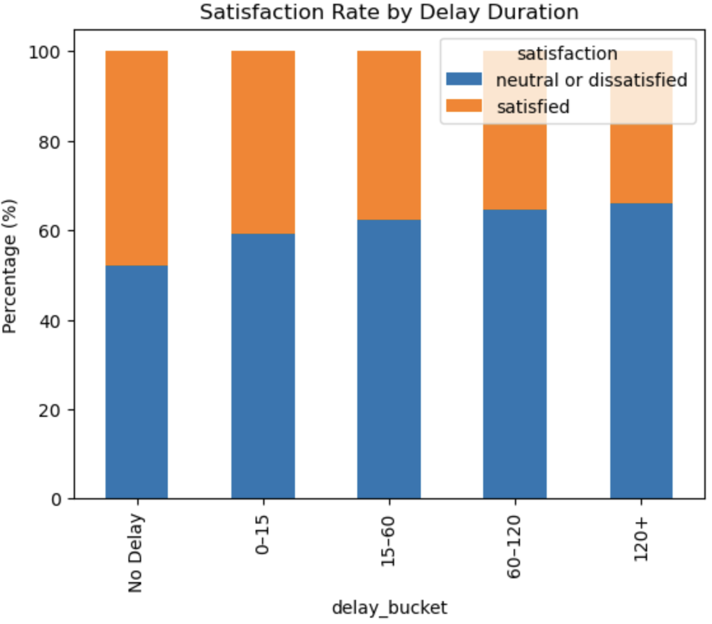

# Airline Passenger Satisfaction Analysis

## Executive Summary

This project explores factors influencing airline passenger satisfaction using Python for data cleaning, exploratory data analysis (EDA), and visualization.

The analysis focuses on understanding how operational factors such as flight delays interact with customer experience ratings, and investigates why some passengers remain satisfied despite experiencing significant delays.

## Business Problem

Airline companies continuously monitor passenger satisfaction to improve customer retention, brand reputation and overall travel experience.

Passenger satisfaction is a key performance indicator for airlines, influencing customer loyalty, brand reputation etc,
While operational disruptions such as flight delays can negatively affect customer experience, airlines have limited control over certain delays caused by factors such as weather, air traffic congestion or airport operations.

This analysis aims to identify which aspects of passenger experience have strongest relationship with satisfaction and explore whether high quality service can help mitigate the impact of delays.

## Objectives

The main questions explored in this project include:

- How does flight delay duration influence passenger satisfaction?
- Which service categories contribute most to passenger satisfaction?
- Arte certain passenger groups more tolerant of operational disruptions?
- What factors explain why some passengers remain satisfied despite experiencing significant delay?

## Dataset

Source:
[Kaggle - Airline Passenger Satisfaction Dataset](https://www.kaggle.com/datasets/teejmahal20/airline-passenger-satisfaction)

The dataset contains:
- Passenger demographics
- Flight delay information
- Travel type and class
- Service quality ratings
- Overall satisfaction levels

## Tools & Technologies

- Python
- Pandas
- NumPy
- Matplotlib
- Seaborn
- Jupyter Notebook

## Data Preparation

Prior to analysis, the dataset was reviewed to ensure data quality and consistency.

Cleaning activities included:

- Identifying and handling missing values
- Checking for duplicate records
- Standardizing column name for analysis
- Validating ordinal service-rating scales (1-5)
- Reviewing categorical and numerical variables for anomalies
- Confirming data types and value consistency

## Exploratory Data Analysis (EDA)

Analysis was structured around the project's key business questions.

### Dataset Overview
- Examined the distribution of satisfied and dissatisfied passengers.
- Established baseline satisfaction levels across the dataset.

### Delay Impact Analysis
- Investigated how delays affect satisfaction
- Created delay threshold groups

  

### Service Quality Analysis
- Compared average service ratings between satisfaction groups

### Delayed but Satisfied Passengers
A focused analysis was conducted on passengers experiencing delays greater than 100 minutes to understand why some customers still reported satisfaction.

## Key Insights

Some key findings from the analysis include:

- Customer satisfaction generally decreases as delay duration increases
- Some passengers remained satisfied despite experiencing long delays
- Service quality factors such as:
  - seat comfort
  - online boarding
  - inflight entertainment
  showed strong differences between satisfied and dissatisfied passengers
- Higher service ratings may help offset dissatisfaction caused by delays

## Visualizations

- Satisfaction distribution charts
- Delay vs satisfaction boxplots
- Satisfaction rate by delay duration
- Service rating comparison heatmaps

## Key Takeaways

Through this project, I strengthened my ability to:

- Clean and prepare real-world datasets for analysis
- Conduct exploratory data analysis using Python
- Build visualizations to communicate findings effectively
- Translate analytical findings into business-oriented insights
- Investigate customer behaviour through a structured analytical approach

## Author

[Shifaa Akhtar]

LinkedIn: [www.linkedin.com/in/shifaa-akhtar] 
